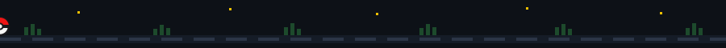

### about me

I like taking things that are slow and making them fast, and taking things
that don't fit in memory and making them fit anyway. Most days that means
living somewhere between Python notebooks and C++ headers, occasionally
yelling at a GPU until it cooperates.

- 🔭 currently building **[locret-llamacpp](https://github.com/PS12007/locret-llamacpp)** — KV-cache eviction for `llama.cpp`, trying to get long-context inference to behave on consumer-grade VRAM
- 🌱 perpetually learning some corner of low-level systems / ML infra I have no business touching yet
- 🐛 professionally fluent in reading stack traces at 2am
- ⚡ fun fact: I trust a plot of the loss curve more than most people's opinions

### tech stack

 

 

### stats

### the snake ate my contribution graph

<picture>
  <source media="(prefers-color-scheme: dark)" srcset="https://raw.githubusercontent.com/PS12007/PS12007/output/github-contribution-grid-snake-dark.svg" />
  <source media="(prefers-color-scheme: light)" srcset="https://raw.githubusercontent.com/PS12007/PS12007/output/github-contribution-grid-snake.svg" />
  
</picture>

(renders after the first run of the <code>generate-snake</code> Action — give it a few minutes)

thanks for stopping by — now go touch some grass (or don't, the fire's cozy)

