<!--
  ╔══════════════════════════════════════════════════════════════╗
  ║  PS12007 — profile README, Pokémon edition                   ║
  ║  ↑ ↑ ↓ ↓ ← → ← → B A START                                   ║
  ║  you found the secret comment. here, take a Rare Candy. 🍬    ║
  ╚══════════════════════════════════════════════════════════════╝
-->

<div align="center">


</div>


## 🔬 PROF. OAK'S INTRO

> **PROF. OAK:** Hello there! Welcome to the world of ~~POKéMON~~ *systems programming*!
> This world is inhabited by creatures called **race conditions**. For some people,
> they are pets. Others use them for fights. Myself… I study them as a profession.
>
> Now, tell me. What is your name?
>
> **▶ PRIYANSH**

I like taking things that are slow and making them fast, and taking things that don't fit
in memory and making them fit anyway. Most days that means living somewhere between Python
notebooks and C++ headers, occasionally yelling at a GPU until it cooperates.

```text
┌─ POKéDEX ENTRY №  021 ────────────────────────────────────────┐
│  PRIYANSH                                    the CACHE POKéMON │
│  HT  1.8 m     WT  ██.█ kg     TYPE  systems / caffeine        │
│                                                                │
│  Nocturnal. Observed evicting KV-cache entries from an 8 GB    │
│  habitat so that longer contexts may survive the winter.       │
│  Trusts a loss curve more than it trusts most opinions.        │
│  Flees when asked to centre a div vertically.                  │
└────────────────────────────────────────────────────────────────┘
```

- 🔭 currently building **[locret-llamacpp](https://github.com/PS12007/locret-llamacpp)** — KV-cache eviction for `llama.cpp`, getting long-context inference to behave on consumer-grade VRAM
- 🌱 perpetually grinding some corner of low-level systems / ML infra I have no business touching yet
- 🐛 professionally fluent in reading stack traces at 2am
- ⚡ fun fact: I trust a plot of the loss curve more than most people's opinions

<div align="center">



</div>


## ⚔️ MY PARTY

<div align="center">

| | POKéMON | TYPE | LV | ABILITY | SIGNATURE MOVE |
|:-:|:--|:-:|:-:|:--|:--|
| 🐍 | **PYTHONX** |  | 68 | Duck Typing | `[x for x in everything]` |
| ⚙️ | **CPLUSAUR** |   | 61 | Zero Overhead | `template<Metaprogram>` |
| 🦀 | **FERRISK** |  | 44 | Borrow Checker | Fearless Concurrency |
| 🔥 | **TORCHIC** |  | 72 | Autograd | `loss.backward()` |
| ⚡ | **CUDAOS** |  | 66 | Warp Speed | `<<<blocks, threads>>>` |
| 🌊 | **DOCKERUNE** |  | 39 | Layer Cache | `compose up -d` |

</div>

<details>
<summary><b>📦 OPEN THE PC BOX</b> — someone's got to hold the rest of them</summary>

<br/>

<div align="center">


<br/>


<br/>


<sub><i>BOX 2 is full of half-finished side projects. We don't open BOX 2.</i></sub>

</div>

</details>


## 📊 BASE STATS

<div align="center">



</div>

### 🔺 TYPE MATCHUPS

<div align="center">

| ✅ SUPER EFFECTIVE AGAINST | 🛡️ NOT VERY EFFECTIVE AGAINST | 🚫 NO EFFECT ON |
|:--|:--|:--|
| accidental `O(n²)` loops | centring a div vertically | "it works on my machine" |
| race conditions | timezone arithmetic | meetings that could be emails |
| 3am heisenbugs | other people's build systems | my own TODO comments |
| unlabelled chart axes | CSS specificity wars | the Wi-Fi at 4pm |

</div>


## 🏅 GYM BADGES

<div align="center">

| BADGE | GYM | EARNED FOR |
|:-:|:--|:--|
| 🔴 | **SEGFAULT BADGE** | survived a pointer bug that only reproduced in release builds |
| 🟢 | **CUDA BADGE** | wrote a kernel that was faster than the library version. once. |
| 🔵 | **CACHE BADGE** | evicted the right KV entries and the perplexity barely moved |
| 🟠 | **TENSOR BADGE** | matched shapes on the first try (allegedly) |
| ⚪ | **BORROW BADGE** | argued with the borrow checker and lost gracefully |
| 🟡 | **LATENCY BADGE** | shaved a p99 down until the graph looked boring |
| 🟣 | **VRAM BADGE** | fit the model. did not fit the batch size. shipped anyway. |
| ⚫ | **??? BADGE** | *locked — requires touching grass* |

</div>

### 🎣 WILD ENCOUNTER RATES

<div align="center">

| LOCATION | RATE | TIME OF DAY |
|:--|:-:|:-:|
| `github.com/PS12007` | 40% | any |
| Route 2AM — Terminal Cave | 30% | night 🌙 |
| CUDA Programming Guide, page 400-something | 20% | night 🌙 |
| Outside, in actual daylight | 10% | ✨ shiny ✨ |

</div>


## 📖 POKéDEX — CAUGHT SO FAR

<details open>
<summary><b>№ 001 · LOCRET-LLAMACPP</b> — <i>the Eviction Pokémon</i></summary>

<br/>

> KV-cache eviction for `llama.cpp`. Decides which parts of the context get to stay
> and which get released back into the wild, so long-context inference stops
> fainting on consumer-grade VRAM.
>
> **TYPE**  
> · **[→ view the entry](https://github.com/PS12007/locret-llamacpp)**

</details>

<details>
<summary><b>№ 002 · WORDLE-SOLVER</b> — <i>the Entropy Pokémon</i></summary>

<br/>

> Guesses words for a living. Attacks the search space instead of the puzzle.
>
> **TYPE**  
> · **[→ view the entry](https://github.com/PS12007/Wordle-Solver)**

</details>

<details>
<summary><b>№ ??? · MISSINGNO.</b> — <i>do not open</i></summary>

<br/>

```text
    ▓▒░ █▀▄ ▒▓ ░▒▓█ ▄▀█ ▒░▓ ██▓▒░
    ▒░▓ ▄█▀ ░▒ ▓█░▒ █▄▀ ▓░▒ ░▒▓██
    your item pack now contains 128 Rare Candies.
    your save file is fine. probably. mostly.
```

<sub>told you not to open it.</sub>

</details>


## 📈 TRAINER STATS

<div align="center">


<sub><i>EXP. points are awarded regardless of whether the commit message was any good.</i></sub>

</div>


## 🐍 A WILD ONIX APPEARED!

<div align="center">

<sub>It used <b>DIG</b> — it's eating my contribution graph.</sub>

<picture>
  <source media="(prefers-color-scheme: dark)" srcset="https://raw.githubusercontent.com/PS12007/PS12007/output/github-contribution-grid-snake-dark.svg" />
  <source media="(prefers-color-scheme: light)" srcset="https://raw.githubusercontent.com/PS12007/PS12007/output/github-contribution-grid-snake.svg" />
  
</picture>

<sub>(renders after the first run of the <code>generate-snake</code> Action — give it a few minutes)</sub>

</div>


## ☎️ POKéGEAR

<div align="center">

<a href="https://github.com/PS12007"></a>
<!-- registered your other numbers? drop them in:
<a href="https://linkedin.com/in/YOUR-HANDLE"></a>
<a href="mailto:YOUR-EMAIL"></a>
-->

<sub>MATCH CALL is enabled. I will pick up eventually.</sub>

</div>


<div align="center">

<sub>thanks for stopping by, trainer — now go touch some grass. <b>(it's the tall kind. be careful.)</b></sub>

</div>
